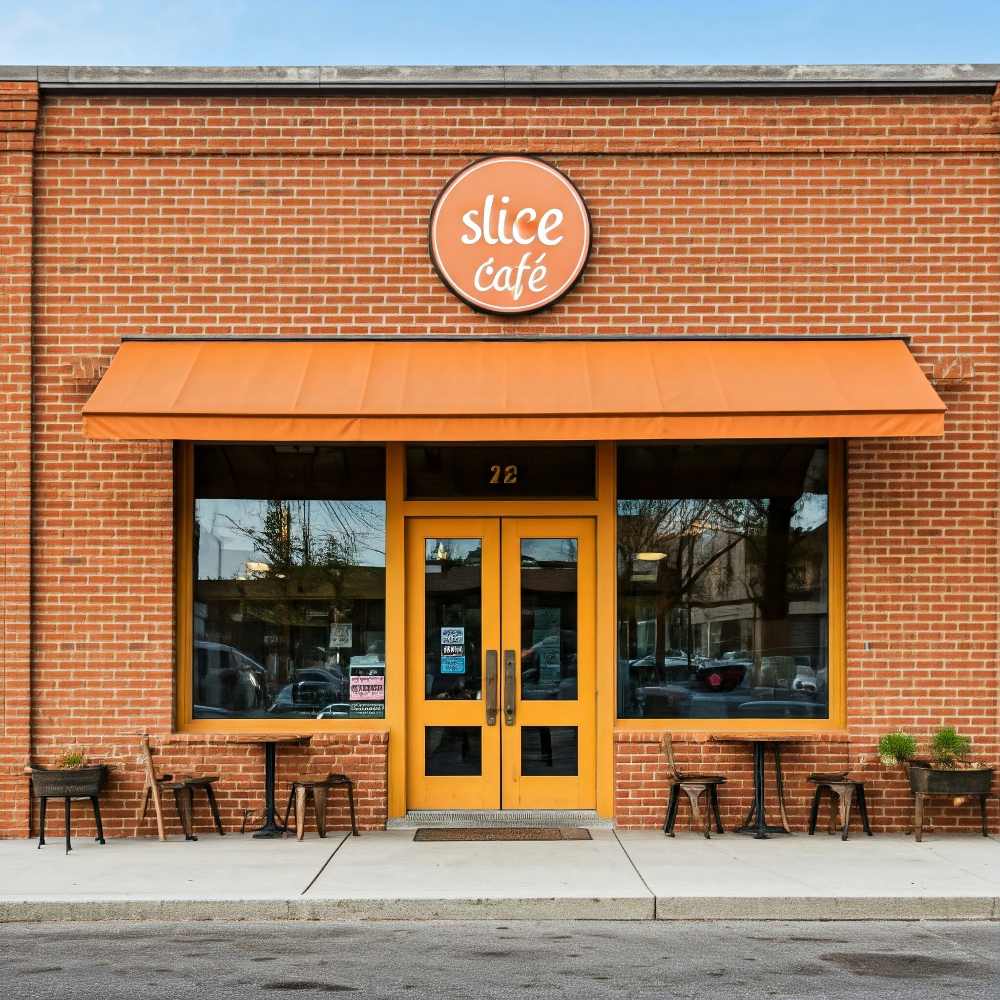

# Business Analysis Report: Slice Café

**Company Name:** Slice Café

**Report Objective:** To identify the performance of menu items, highlight underperforming items, and understand the preferences of top-spending customers.

## Executive Summary
This report provides an analysis of Slice Café’s menu performance and customer preferences using two datasets: menu items and order details. The goal was to identify which menu items perform well, which do not, and what top-spending customers prefer. All data preparation and analysis were conducted using SQL.
Key findings include:
 
1. **Top Menu Item:** The American Hamburger is the most ordered menu item.
 
2. **Least Ordered Item:** The Mexican Chicken Tacos have the lowest order count.

3. **Top-Spending Customers' Preference:** While no Italian item is the most ordered, Italian meals collectively bring in the highest revenue, driven by purchases from top-spending customers.

## Key Insights
1. **Menu Item Performance:**
    - American Hamburger is the café’s best-selling item, consistently ordered across all customer segments.
    - Mexican Chicken Tacos are the least popular, indicating low customer interest or inadequate marketing.

2. **Top Customer Preferences:**
    - Italian meals are highly favored by the café’s top spenders, contributing significantly to overall revenue.
    - Despite Italian meals not topping the order volume, they hold strong profitability due to their high price points and popularity with premium customers.

3. **Revenue Insights by Category:**
    - Italian meals contribute the most cash inflow among all menu categories, outperforming even categories with higher order counts.
    - Mexican items underperform both in terms of volume and revenue.

## Recommendations
1. **Focus on Italian Menu Items:**
    - Retain and potentially expand the Italian menu, as it appeals to high-spending customers and generates significant revenue.
    - Introduce limited-time offers or seasonal Italian dishes to maintain customer interest and loyalty.

2. **Address Underperforming Menu Items:**
    - Investigate why Mexican Chicken Tacos are underperforming. Consider customer feedback, pricing, and presentation to improve their appeal.
    - If improvements fail, consider replacing them with other high-demand items or experimenting with different Mexican offerings.

3. **Leverage Popular Menu Items:**
    - Continue promoting the American Hamburger as the top-seller through deals or meal bundles to maintain its popularity.

4. **Customer Segmentation Campaigns:**
    - Use insights about top spenders to craft tailored marketing campaigns that highlight Italian dishes, potentially offering loyalty rewards or premium experiences for high-value customers.

## Conclusion
The analysis demonstrates that Slice Café’s menu has strong performers, such as the American Hamburger, but also highlights opportunities to address underperformers like Mexican Chicken Tacos. With Italian meals driving significant revenue from top-spending customers, the café should focus on enhancing and promoting its Italian offerings while optimizing other menu items to increase overall profitability.

**Tool Used:** SQL (data preparation, analysis)
